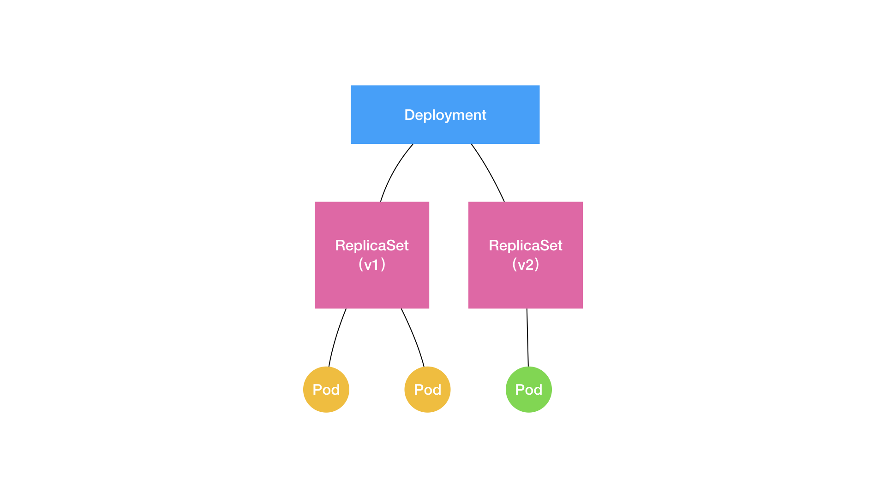

Deployment实现Pod的“水平扩展/收缩（horizontal scaling out/in）”。这个能力的实现，依赖Kubernetes项目中的一个非常重要的概念（API对象）：ReplicaSet

~~~yaml
apiVersion: apps/v1
kind: Deployment
metadata:
  name: nginx-deployment
  labels:
    app: nginx
spec:
  replicas: 3
  selector:
    matchLabels:
      app: nginx
  template:
    metadata:
      labels:
        app: nginx
    spec:
      containers:
      - name: nginx
        image: nginx:1.7.9
        ports:
        - containerPort: 80
~~~

具体的实现上，可以通过如下的图描述Deployment、ReplicaSet、Pod三者之间的关系

> ReplicaSet负责通过“控制器模式”，保证系统中Pod的个数永远等于指定的个数（比如：3个）
>
> Deployment负责通过“控制器模式”，来操作ReplicaSet的个数和属性，进而实现“水平扩展/收缩”和“滚动更新”这两个编排动作

### 水平扩展/收缩

Deployment Controller通过修改它所控制的ReplicaSet的Pod副本个数，实现“水平扩展/收缩”功能

~~~bash
# kubectl scale deployment nginx-deployment --replicas=4
~~~

### 滚动更新

创建nginx-deployment

~~~bash
# kubectl create -f nginx-deployment.yaml --record
~~~

> record参数：记录下每次操作所执行的命令，以方便后续查看

创建nginx-deployment创建后的状态信息

~~~bash
# kubectl get deployments
NAME               DESIRED   CURRENT   UP-TO-DATE   AVAILABLE   AGE
nginx-deployment   3         0         0            0           1s
~~~

> DESIRED：用户期望的Pod副本个数（spec.replicas的值）
>
> CURRENT：当前处于running状态的Pod个数
>
> UP-TO-DATE：当前处于最新版本的Pod的个数，所谓最新版本指的是Pod的Spec部分与Deployment里Pod模板里定义的完全一致
>
> AVAILABLE：当前已经可用的Pod的个数，即：既是Running状态，又是最新版本，并且已经处于Ready（健康检查正确）状态的Pod的个数

实时查看Deployment对象状态变化

~~~bash
# kubectl rollout status deployment/nginx-deployment
Waiting for rollout to finish: 2 out of 3 new replicas have been updated...
deployment.apps/nginx-deployment successfully rolled out
~~~

查看Deployment控制的ReplicaSet

~~~bash
# kubectl get rs
NAME                          DESIRED   CURRENT   READY   AGE
nginx-deployment-6987cdb55b   3         3         3       20s
~~~

编辑Etcd里的API对象进行修改

~~~bash
# kubectl edit deployment/nginx-deployment
... 
    spec:
      containers:
      - name: nginx
        image: nginx:1.9.1 # 1.7.9 -> 1.9.1
        ports:
        - containerPort: 80
...
deployment.extensions/nginx-deployment edited
~~~

编辑完成，保存退出后，Kubernetes就会立刻触发“滚动更新”的过程。通过kubectl rollout status指令查看nginx-deployment的状态变化

~~~bash
# kubectl rollout status deployment/nginx-deployment
Waiting for rollout to finish: 2 out of 3 new replicas have been updated...
deployment.extensions/nginx-deployment successfully rolled out
~~~

> “滚动更新”的过程为了保证服务的连续性，Deployment Controller会确保在任何时间窗口内只有指定比例的Pod处于离线状态。同时也确保在任何时间窗口内，只有指定比例的新Pod被创建出来。这两个比例的值都是可以配置的，默认都是DESIRED值的25%
>
> ~~~bash
> [root@lab1 ~]# kubectl get deployment nginx-deployment -o yaml
> apiVersion: extensions/v1beta1
> kind: Deployment
> ...
> spec:
>   ...
>   strategy:
>     rollingUpdate:
>       maxSurge: 25%
>       maxUnavailable: 25%
>     type: RollingUpdate
> ~~~
>
> maxSurge：指定的是除了DESIRED数量之外，在一次“滚动更新”中，Deployment控制器还可以创建多少个新Pod
>
> maxUnavailable：指定的是在一次“滚动更新”中，Deployment控制器可以删除多少个旧的Pod

通过Deployment的Events，查看“滚动更新”的流程

~~~bash
# kubectl describe deployment nginx-deployment
...
Events:
  Type    Reason             Age   From                   Message
  ----    ------             ----  ----                   -------
...
  Normal  ScalingReplicaSet  24s   deployment-controller  Scaled up replica set nginx-deployment-1764197365 to 1
  Normal  ScalingReplicaSet  22s   deployment-controller  Scaled down replica set nginx-deployment-3167673210 to 2
  Normal  ScalingReplicaSet  22s   deployment-controller  Scaled up replica set nginx-deployment-1764197365 to 2
  Normal  ScalingReplicaSet  19s   deployment-controller  Scaled down replica set nginx-deployment-3167673210 to 1
  Normal  ScalingReplicaSet  19s   deployment-controller  Scaled up replica set nginx-deployment-1764197365 to 3
  Normal  ScalingReplicaSet  14s   deployment-controller  Scaled down replica set nginx-deployment-3167673210 to 0

~~~

通过“滚动更新”过程完成，查看新、旧两个ReplicaSet的最终状态

~~~bash
# kubectl get rs
NAME                          DESIRED   CURRENT   READY   AGE
nginx-deployment-5987dbf57b   3         3         3       6s
nginx-deployment-6987cdb55b   0         0         0       30s
~~~

”滚动更新“的过程，可以通过如下的图描述Deployment、ReplicaSet、Pod三者之间的关系

### Deployment对应用进行版本控制原理

使用kubectl set images指令，直接修改nginx-deployment所使用的镜像

~~~bash
# kubectl set image deployment/nginx-deployment nginx=nginx:1.91
deployment.extensions/nginx-deployment image updated
~~~

检查ReplicaSet状态

~~~bash
# kubectl get rs
NAME                          DESIRED   CURRENT   READY   AGE
nginx-deployment-5987dbf57b   2         2         2       24s
nginx-deployment-6987cdb55b   0         0         0       35s
nginx-deployment-5c689d88bb   2         2         0       7s
~~~

> nginx:1.91镜像在Docker Hub中并不存在，所以这个Deployment的“滚动更新”被触发后，会立刻报错并停止

回滚到以前的Deployment为三个的Pod旧版本

~~~bash
# kubectl rollout undo deployment/nginx-deployment
deployment.extensions/nginx-deployment
~~~

> 想回滚到更早之前的版本（由于在创建Deployment时指定了**record**参数）
>
> ~~~bash
> # kubectl rollout history deployment/nginx-deployment
> deployments "nginx-deployment"
> REVISION    CHANGE-CAUSE
> 1           kubectl create -f nginx-deployment.yaml --record
> 2           kubectl edit deployment/nginx-deployment
> 3           kubectl set image deployment/nginx-deployment nginx=nginx:1.91
> ~~~
>
> 查看每个版本对应Deployment的API对象修改细节
>
> ~~~bash
> # kubectl rollout history deployment/nginx-deployment --revision=2
> ~~~
>
> 指定回滚版本
>
> ~~~bash
> # kubectl rollout undo deployment/nginx-deployment --to-revision=2
> deployment.extensions/nginx-deployment
> ~~~

对Deployment进行的每一次更新操作，都会生成一个新的ReplicaSet对象。Kubernetes项目还提供了一些指令，使得对Deployment的多次更新操作，最后只生成一个ReplicaSet对象

~~~bash
# kubectl rollout pause deployment/nginx-deployment
deployment.extensions/nginx-deployment paused

# kubectl set image deployment/nginx-deployment nginx=nginx:1.9.1
deployment.extensions/nginx-deployment image updated

# kubectl edit deployment/nginx-deployment

# kubectl rollout resume deploy/nginx-deployment
deployment.extensions/nginx-deployment resumed
~~~

> kubectl rollout pause：使Deployment处于“暂停”状态，在这期间对Deployment所做的修改，都不会触发新的“滚动更新”，也不会创建新的ReplicaSet对象
>
> kubectl rollout resume：把Deployment"恢复"回来

Kubernetes通过Deployment对象的spec.revisionHistoryLimit来设置对Deployment保留“历史版本”的个数