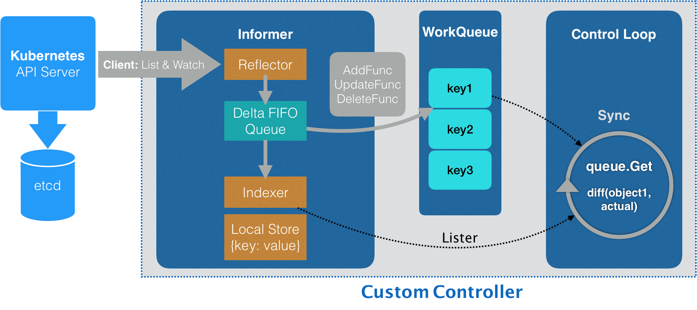

声明式API：kubectl apply 命令，执行的是一个对原有API对象的PATCH操作。是 Kubernetes项目编排能力“赖以生存”的核心所在。

Kubernetes编程范式：如何使用控制器模式，同Kubernetes里API对象的“增、删、改、查“进行协作，进而完成用户业务逻辑的编写过程。

Kubernetes的API对象在Etcd里的完整资源路径是由：Group（API组）、Version（API版本）和Resource（API资源类型）三个部分组成。所有的API对象呈现如下的树形结构

Kubernetes创建API对象流程

全新API插件机制CRD（Custome Resource Definition）：从v1.7开始，允许用户在Kubernetes中添加一个跟Pod、Node类似的新的API资源类型，即：自定义API资源

Kubernetes创建自定义控制器的工作流程

> Informer：是一个自带缓存和索引机制，可以触发Handler的客户端库。这个本地缓存在Kubernetes中一般被称为Store，索引一般被称为Index
>
> Informer使用了Reflector包，它是一个可以通过ListAndWatch机制获取并监听API对象变化的客户端封装
>
> Reflector和Informer之间使用一个“增量先进先出队列”进行协同。而Informer与自定义编写的控制循环之间，则使用一个工作队列进行协同
>
> 在实际应用中，除了控制循环之外的代码，实际上都是Kubernetes为我们自动生成的，即：pkg/client{informer,listers,clientset}里的内容。而这些自动生成的代码，就为我们提供了一个可靠而高效地获取API对象“期望状态”的编程库
>
> 所以，作为开发者就只需要关注如何拿到“实际状态”，然后如何拿它去跟“期望状态”做比较，从而决定接下来要做的业务逻辑即可