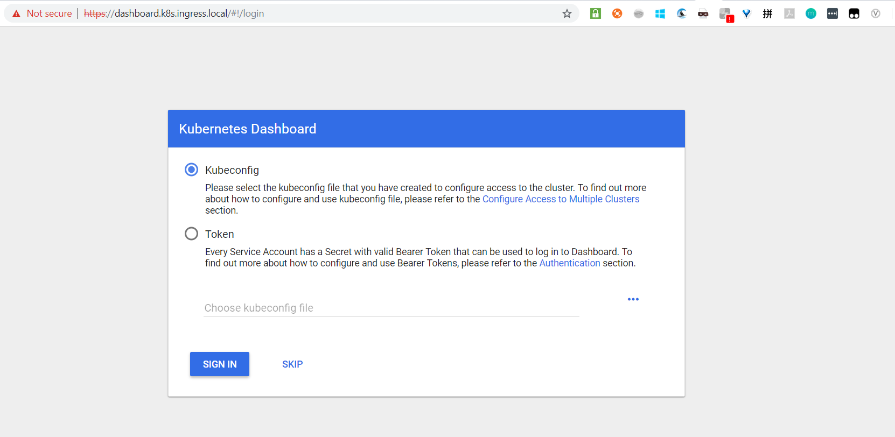
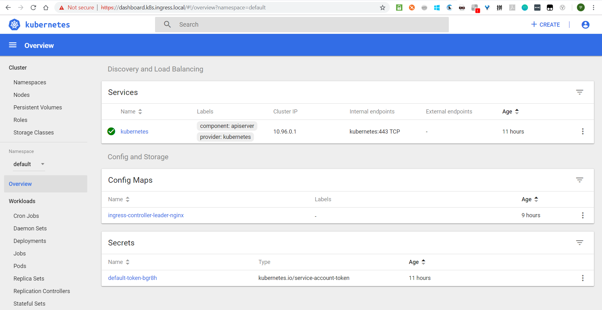

### 通过Ingress访问Dashboard

* 需要安装[Nginx Ingress Controller](./01.Nginx-ingress.md)

* 示例的Ingress主机域名为dashboard.k8s.ingress.local，在DNS中配置该记录对应任意worker节点地址即可访问

  ```bash
  172.27.129.111 dashboard.k8s.ingress.local
  ```

  >注意：如果是通过Windows+Vagrant搭建的话同样需要将该配置设置在hosts的DNS文件中

#### 将TLS证书配置到Kubernetes

使用Ingress将HTTPS的服务暴露到集群外部时，需要HTTPS证书。创建dashboard的TLS证书，若有CA颁发的证书可跳过这步，通过openssl生成了域名为dashboard.k8s.ingress.local的10年（3650天）自签名证书

```bash
openssl req -x509 -sha256 -nodes -days 3650 -newkey rsa:2048 -keyout tls.key -out tls.crt -subj "/CN=dashboard.k8s.ingress.local/O=dashboard.k8s.ingress.local"
```

基于以上创建的证书生成secret

```bash
kubectl create secret tls kubernetes-dashboard-certs --key tls.key --cert tls.crt -n kube-system
```

#### 使用Helm部署Dashboard

创建部署文件kubernetes-dashboard.yaml

```yaml
ingress:
  enabled: true
  hosts:
    - dashboard.k8s.ingress.local
  annotations:
    nginx.ingress.kubernetes.io/ssl-redirect: "true"
    nginx.ingress.kubernetes.io/secure-backends: "true"
  tls:
    - secretName: kubernetes-dashboard-certs
      hosts:
      - dashboard.k8s.ingress.local
rbac:
  clusterAdminRole: true
```

通过Helm进行安装

```bash
helm install stable/kubernetes-dashboard \
-n kubernetes-dashboard \
--namespace kube-system  \
-f kubernetes-dashboard.yaml
```

通过浏览器访问Dashboard



获取登录Token

```bash
# kubectl -n kube-system describe secret/$(kubectl -n kube-system get secret | grep dashboard-token | awk '{print $1}')
Name:         kubernetes-dashboard-token-46znm
Namespace:    kube-system
Labels:       <none>
Annotations:  kubernetes.io/service-account.name: kubernetes-dashboard
              kubernetes.io/service-account.uid: a4bc743f-e194-11e8-851f-525400c9c704

Type:  kubernetes.io/service-account-token

Data
====
ca.crt:     1025 bytes
namespace:  11 bytes
token:      eyJhbGciOiJSUzI1NiIsImtpZCI6IiJ9.eyJpc3MiOiJrdWJlcm5ldGVzL3NlcnZpY2VhY2NvdW50Iiwia3ViZXJuZXRlcy5pby9zZXJ2aWNlYWNjb3VudC9uYW1lc3BhY2UiOiJrdWJlLXN5c3RlbSIsImt1YmVybmV0ZXMuaW8vc2VydmljZWFjY291bnQvc2VjcmV0Lm5hbWUiOiJrdWJlcm5ldGVzLWRhc2hib2FyZC10b2tlbi00NnpubSIsImt1YmVybmV0ZXMuaW8vc2VydmljZWFjY291bnQvc2VydmljZS1hY2NvdW50Lm5hbWUiOiJrdWJlcm5ldGVzLWRhc2hib2FyZCIsImt1YmVybmV0ZXMuaW8vc2VydmljZWFjY291bnQvc2VydmljZS1hY2NvdW50LnVpZCI6ImE0YmM3NDNmLWUxOTQtMTFlOC04NTFmLTUyNTQwMGM5YzcwNCIsInN1YiI6InN5c3RlbTpzZXJ2aWNlYWNjb3VudDprdWJlLXN5c3RlbTprdWJlcm5ldGVzLWRhc2hib2FyZCJ9.NCkHvUStifatwXJIIi6RHAd6ivf1E_zskw3Kqxpb_ggo-eG6HkJfcjIJFFsekpKEXNFcyreSGmw8fUCUR0TivI0zMZoyx8_MS4VOkLHK13caL145x3if4VQdbbv85NpbIu_juJq_WsNDJDZHvwe55y6OEBkeWGVGD7k1wsbwKFug__BFD6EzfxbHktQMoVvBwELUmFZuM177iBUuOrvfqjCQBV_MQBf93gXM1y0H2SNURcI-Zua1JqoaVrCYJhMiBtRvwuINatinAuaw2d4xX5lQLoYQXrAOvhMkqscX1sz1TIu3M-Jswuml884rn-7AXepBDEMqlQz95dCSvesCkg
```

通过Dashboard的登录窗口使用上面的token登录



