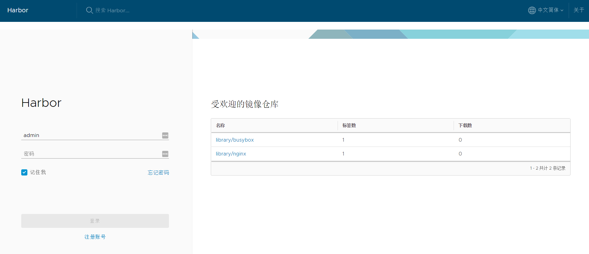

#### 安装Docker CE

* 安装依赖的软件包

  ```shell
  # yum install -y yum-utils \
    device-mapper-persistent-data \
    lvm2
  ```

* 添加国内镜像阿里源

  ```shell
  # yum-config-manager --add-repo http://mirrors.aliyun.com/docker-ce/linux/centos/docker-ce.repo
  ```

* 安装Docker

  ```shell
  # yum install docker-ce
  # systemctl start docker
  ```

  > 默认配置下通过docker info命令，如果在 CentOS 使用 Docker CE 看到下面的这些警告信息：
  >
  > WARNING: bridge-nf-call-iptables is disabled
  > WARNING: bridge-nf-call-ip6tables is disabled
  >
  > #请添加内核配置参数以启用这些功能。
  > $ sudo tee -a /etc/sysctl.conf <<-EOF
  > net.bridge.bridge-nf-call-ip6tables = 1
  > net.bridge.bridge-nf-call-iptables = 1
  > EOF
  > 然后重新加载 sysctl.conf 即可

#### 安装Docker Compose

* 下载最新的Docker Componse

  ```shell
  # curl -L "https://github.com/docker/compose/releases/download/1.23.1/docker-compose-$(uname -s)-$(uname -m)" -o /usr/local/bin/docker-compose
  ```

* 对二进制文件赋予可执行权限

  ```shell
  # chmod +x /usr/local/bin/docker-compose
  ```

* 验证安装

  ```shell
  # docker-compose --version
  ```

## Harbor环境

#### 配置HTTPS

> 如果有外网域名可以参考[实现了 acme 协议, 从 letsencrypt 生成免费的证书. ](https://github.com/Neilpang/acme.sh)

1. 安装openssl相关软件包

   ```shell
   # yum -y install pcre pcre-devel zlib-devel openssl openssl-devel
   ```

2. 创建CA根证书

   ```shell
   # mkdir -p /data/cert && cd /data/cert/
   # openssl genrsa -out ca.key 4096
   # openssl req -x509 -new -nodes -sha512 -days 3650 \
       -subj "/C=CN/ST=Shanghai/L=Shanghai/O=DevOps/OU=Personal/CN=repo.harbor.com" \
       -key ca.key \
       -out ca.crt
   ```

3. 生成证书签名, 设置访问域名为 repo.harbor.com

   ```shell
   # openssl genrsa -out repo.harbor.com.key 4096
   
   # openssl req -sha512 -new \
       -subj "/C=CN/ST=Shanghai/L=Shanghai/O=DevOps/OU=Personal/CN=repo.harbor.com" \
       -key repo.harbor.com.key \
       -out repo.harbor.com.csr
   
   # cat > v3.ext <<-EOF
   authorityKeyIdentifier=keyid,issuer
   basicConstraints=CA:FALSE
   keyUsage = digitalSignature, nonRepudiation, keyEncipherment, dataEncipherment
   extendedKeyUsage = serverAuth 
   subjectAltName = @alt_names
   
   [alt_names]
   DNS.1=repo.harbor.com
   DNS.2=node2
   EOF
   
   # openssl x509 -req -sha512 -days 3650 \
   	-extfile v3.ext \
       -CA ca.crt -CAkey ca.key -CAcreateserial \
       -in repo.harbor.com.csr \
       -out repo.harbor.com.crt
   ```

4. 为Docker配置服务器证书，密钥和CA（解决通过docker login repo.harbor.com报x509错误）

   ```shell
   # openssl x509 -inform PEM -in repo.harbor.com.crt -out repo.harbor.com.cert
   # cp repo.harbor.com.cert /etc/docker/certs.d/repo.harbor.com/
   # cp repo.harbor.com.key /etc/docker/certs.d/repo.harbor.com/
   # cp ca.crt /etc/docker/certs.d/repo.harbor.com/
   ```

#### 安装Harbor

1. 从github harbor 官网 release 页面下载指定版本的安装包

   ```shell
   # wget https://storage.googleapis.com/harbor-releases/release-1.6.0/harbor-offline-installer-v1.6.2.tgz
   # tar zxvf harbor-offline-installer-v1.6.2.tgz
   ```

2. 配置Harbor

   ```shell
   # vi harbor.cfg
   # 设置私有仓库的访问地址，可以使用ip、域名，不可以设置为127.0.0.1或localhost
   hostname = repo.harbor.com
   
   # 访问协议，默认是http，也可以设置https，如果设置https，则nginx ssl需要设置on
   ui_url_protocol = https
   
   ssl_cert = /data/cert/repo.harbor.com.crt
   ssl_cert_key = /data/cert/repo.harbor.com.key
   secretkey_path = /data
   
   # 启动Harbor后，管理员UI登录的密码，默认是Harbor12345
   harbor_admin_password = Harbor12345
   
   # 认证方式，这里支持多种认证方式，如LADP、本次存储、数据库认证。默认是db_auth，mysql数据库认证
   auth_mode = db_auth
   
   # 是否开启自注册
   self_registration = on
   
   # Token有效时间，默认30分钟
   token_expiration = 30
   
   # 用户创建项目权限控制，默认是everyone（所有人），也可以设置为adminonly（只能管理员）
   project_creation_restriction = everyone
   ```

3. 启动Harbor

   ```shell
   # ./install.sh
   ```

4. 将repo.harbor.com添加到hosts文件中，通过浏览器访问repp.harbor.com，使用admin/Harbor12345登录

   

