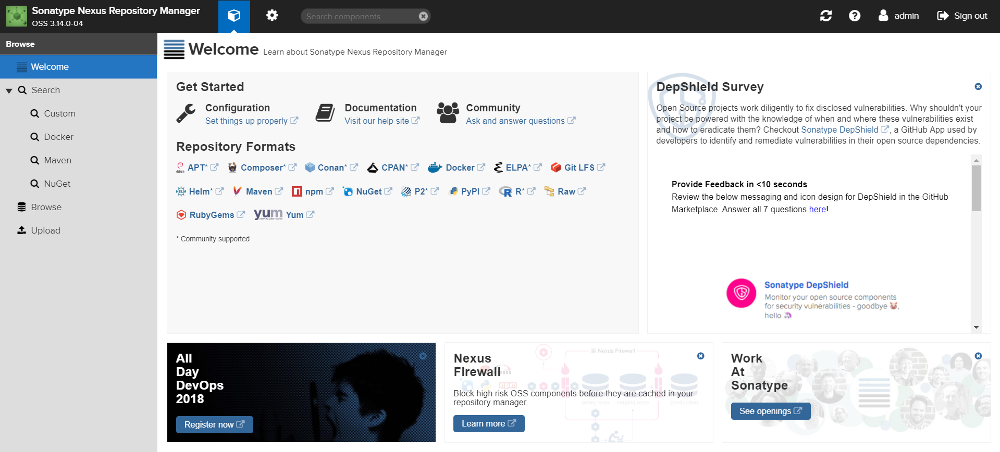
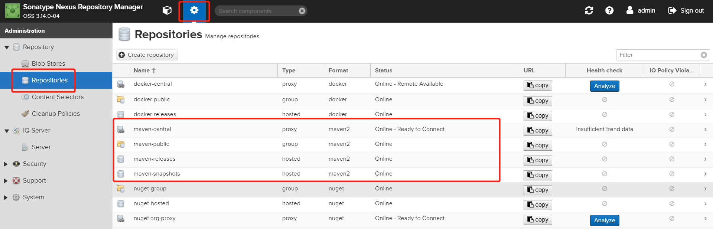
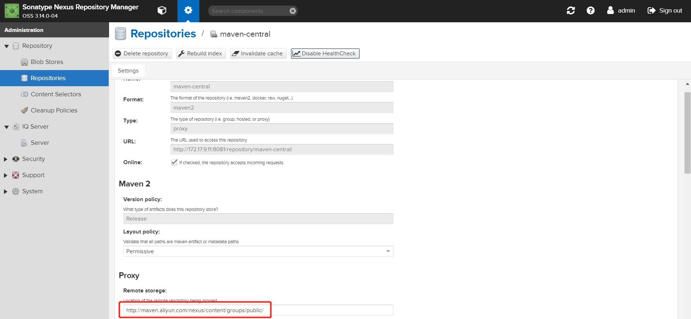
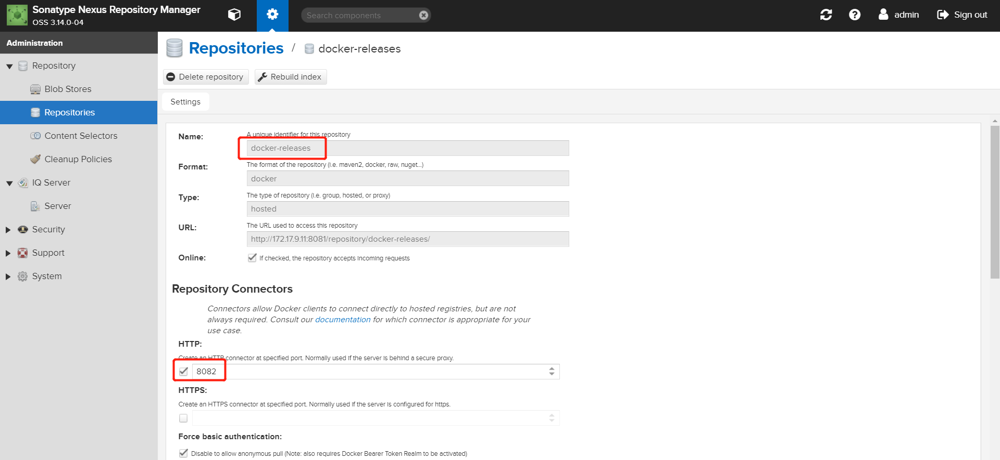
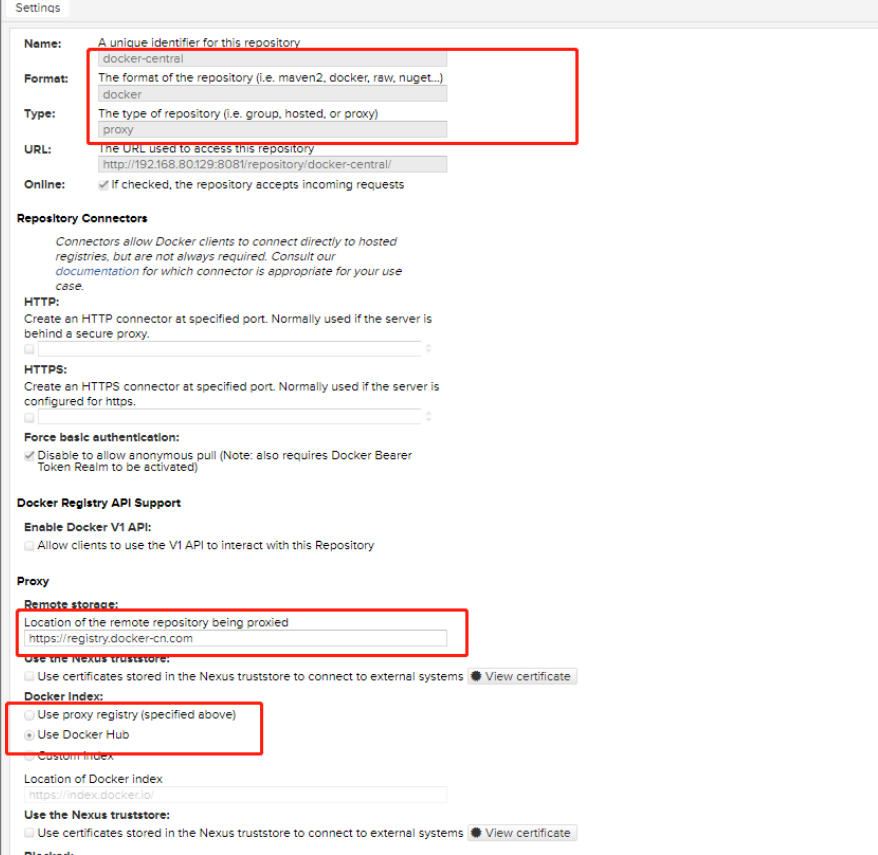
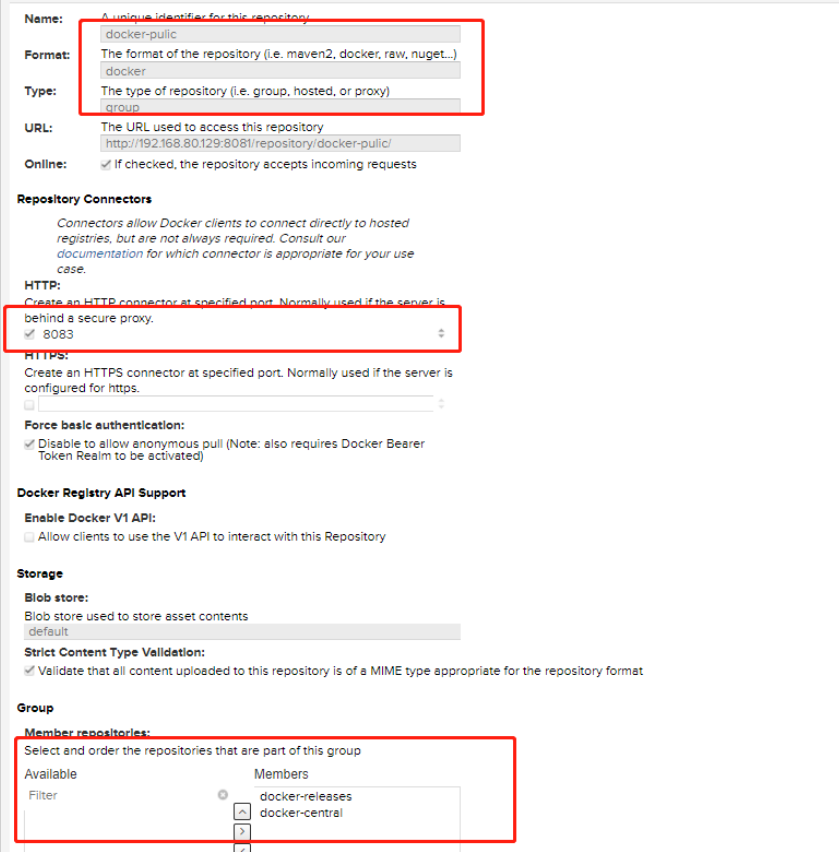

## Nexus私服

* 管理Jar包
* 管理Docker镜像
* 通过dockerfile-maven-plugin插件编译打包docker镜像

#### 通过Docker安装Nexus

* 通过vagrant搭建系统环境

  ~~~vagrant
  $num_instances = 1
  
  Vagrant.configure("2") do |config|
    config.vm.box_check_update = false
    config.vm.synced_folder ".", "/vagrant", type: "rsync"
      (1..$num_instances).each do |id|
      config.vm.define "node#{id}" do |node|
        node.vm.box="centos/7"
        node.ssh.insert_key = false
        node.vm.hostname = "node#{id}"
        node.vm.network :private_network, ip: "172.17.9.#{id+10}"
        node.vm.provider :virtualbox do |vb, override|
          vb.name = "node#{id}"
          vb.gui = false
          vb.memory = 4096
          vb.cpus = 2
        end
      end
    end
  end
  ~~~

* 使用Ansible安装Docker环境

  通过yum安装ansible

  ```shell
  [root@node1 ~]# yum install -y epel-release
  [root@node1 ~]# yum install -y ansible
  ```

  > 需要设置ssh免密，否则后面通过ansible安装docker时会出连接权限问题
  >
  > [root@node1 ~]# ssh-keygen -t dsa
  >
  > [root@node1.ssh]# cat ./id_dsa.pub >>  ./authorized_keys
  >
  > [root@node1 ~]# ssh node1
  > Last login: Mon Dec  3 09:41:00 2018 from 127.0.0.1

  在[Ansible Galaxy](https://galaxy.ansible.com) 搜索 docker，使用 geerlingguy 贡献的 docker role 安装Docker，通过 ansible-galaxy 命令可以把上面搜索到的 role 安装到本地

  ```shell
  [root@node1 ~]# ansible-galaxy install geerlingguy.docker
  
  [root@node1 ~]# vi /etc/ansible/hosts
  [docker]
  node1
  ```

  创建 playbook 文件 ansible_docker.yaml，其中引用已经安装好的 role 来完成 docker 的安装

  ```yaml
  ---
  - hosts: node1
    vars:
      docker_users:
        - root
    roles:
      - role: geerlingguy.docker
        become: yes
  ```

  安装docker

  ```shell
  [root@node1 ansible-docker]# ansible-playbook -u root ansible_docker.yaml
  ```

  检查安装docker结果

  ```shell
  [root@node1 ansible-docker]# docker version
  ```

* 启动Nexus

  ```shell
  [root@node1 ~]# docker run -d -p 8081:8081 -p 8082:8082 -p 8083:8083 --name nexus3 -v /home/nexus/nexus-data:/nexus-data --restart=always sonatype/nexus3
  ```

  > -v /home/nexus/nexus-data:/nexus-data：将数据挂载到宿主机
  >
  > **持久化数据有两种通用的方法来处理：**
  >
  > * 使用数据量。由于数据卷是持久的，直到没有容器使用它们，卷可以专门为此创建。这是推荐的方法
  >
  >   docker volume create --name nexus-data 
  >   docker run -d -p 8081:8081 --name nexus -v nexus-data:/nexus-data sonatype/nexus3
  >
  > * 将主机目录挂载为卷。这不是可移植的，因为它依赖于在主机上具有正确权限的目录。但是，在需要将该卷分配给某些特定的底层存储的某些情况下，它可能很有用。
  >
  >   mkdir -p /home/nexus/nexus-data && chown -R 200 /home/nexus/nexus-data
  >   $ docker run -d -p 8081:8081 --name nexus -v /some/dir/nexus-data:/nexus-data sonatype/nexus3
  >
  > 8081：nexus3站点端口
  >
  > 8082：docker(hosted)私有仓库，可以pull和push
  >
  > 8083：docker(proxy)代理远程仓库，只能pull

* 访问http://172.17.9.11:8081/，通过admin/admin123登录

  

#### Nexus管理Maven私服

* Nexus设置Maven仓库

  

  > maven-central        代理中央仓库，从公网下载jar 
  >
  > maven-release       发布版本内容（即自己公司发行的jar的正式版本） 
  >
  > maven-snapshots  发布版本内容（即自己公司发行的jar的快照版本）
  >
  > maven-public          以上三个仓库的小组 

  设置maven-central代理位置，阿里的国内镜像：<http://maven.aliyun.com/nexus/content/groups/public/> 

  

#### Nexus管理Docker私服

- 创建docker-releases(hosted )

  | 项目              | 详细说明        |
  | ----------------- | :-------------- |
  | 类型              | docker (hosted) |
  | Name              | docker-releases |
  | Blob store        | default         |
  | Deployment policy | Allow redeploy  |

  

- 创建docker-central(proxy)

  | 项目                                            | 详细说明                                                     |
  | ----------------------------------------------- | ------------------------------------------------------------ |
  | 类型                                            | docker (proxy)                                               |
  | Name                                            | docker-central                                               |
  | Location of the remote repository being proxied | [https://registry.docker-cn.com](https://registry.docker-cn.com/) |
  | Docker Index                                    | Use Docker Hub                                               |
  | Blob store                                      | default                                                      |

  

* 创建docker-public(group)

  | 项目                | 详细说明        |
  | ------------------- | :-------------- |
  | 类型                | docker (group)  |
  | Name                | docker-public   |
  | HTTP Port           | 8083            |
  | Member repositories | docker-central  |
  | Member repositories | docker-releases |
  | Blob store          | default         |

  

* 设置Docker服务/etc/docker/daemon.json

  ```json
  {
  	"registry-mirrors": ["https://registry.docker-cn.com"],
  	"insecure-registries": ["172.17.9.11:8082","172.17.9.11:8083"],
  	"disable-legacy-registry": true
  }
  ```

* 重启Docker服务，并进行登录验证

  ```shell
  [root@node1 nexus]# systemctl restart docker
  [root@node1 nexus]# docker login -u admin -p admin123 172.17.9.11:8082          
  WARNING! Using --password via the CLI is insecure. Use --password-stdin.        
  WARNING! Your password will be stored unencrypted in /root/.docker/config.json. 
  Configure a credential helper to remove this warning. See                       
  https://docs.docker.com/engine/reference/commandline/login/#credentials-store   
                                                                                  
  Login Succeeded                                                                 
  [root@node1 nexus]# docker login -u admin -p admin123 172.17.9.11:8083          
  WARNING! Using --password via the CLI is insecure. Use --password-stdin.        
  WARNING! Your password will be stored unencrypted in /root/.docker/config.json. 
  Configure a credential helper to remove this warning. See                       
  https://docs.docker.com/engine/reference/commandline/login/#credentials-store   
                                                                                  
  Login Succeeded       
  [root@node1 nexus]# docker pull 172.17.9.11:8083/java
  Using default tag: latest
  latest: Pulling from java
  5040bd298390: Pull complete
  fce5728aad85: Pull complete
  76610ec20bf5: Pull complete
  60170fec2151: Pull complete
  e98f73de8f0d: Pull complete
  11f7af24ed9c: Pull complete
  49e2d6393f32: Pull complete
  bb9cdec9c7f3: Pull complete
  Digest: sha256:c1ff613e8ba25833d2e1940da0940c3824f03f802c449f3d1815a66b7f8c0e9d
  Status: Downloaded newer image for 172.17.9.11:8083/java:latest
  ```

#### Docker开启运程访问

* 创建/etc/systemd/system/docker.service.d目录(或者在/usr/lib/systemd/system/docker.service中的[Service]部分修改)

  ```shell
  [root@node1 ~]# mkdir -p /etc/systemd/system/docker.service.d
  ```

* 创建/etc/systemd/system/docker.service.d/http-proxy.conf文件

  ```shell
  [root@node1 ~]# vi /etc/systemd/system/docker.service.d/http-proxy.conf
  [Service]
  ExecStart=
  ExecStart=/usr/bin/dockerd -H tcp://0.0.0.0:2375 -H unix:///var/run/docker.sock -H tcp://0.0.0.0:7654
  ```

  > 默认2375为主管理端口，[unix://var/run/docker.sock](https://link.jianshu.com/?t=unix%3A%2F%2Fvar%2Frun%2Fdocker.sock)用于本地管理，7654是备用端口

* 将管理地址写入/etc/profile

  ```shell
  [root@node1 ~]# echo 'export DOCKER_HOST=tcp://0.0.0.0:2375' >> /etc/profile
  [root@node1 ~]# source /etc/profile
  ```

* docker重新读取配置文件，重启docker服务

  ```shell
  [root@node1 ~]# systemctl daemon-reload
  [root@node1 ~]# systemctl restart docker
  ```

* 查看docker进程，发现docker 守护进程在已经监听2375的tcp端口

  ```shell
  [root@node1 ~]# ps -ef | grep docker
  root     11507     1  0 12:37 ?        00:00:00 /usr/bin/dockerd -H tcp://0.0.0.0:2375 -H unix:///var/run/docker.sock
  root     11628 11507  0 12:37 ?        00:00:00 /usr/bin/docker-proxy -proto tcp -host-ip 0.0.0.0 -host-port 8083 -container-ip 172.18.0.2 -container-port 8083
  root     11641 11507  0 12:37 ?        00:00:00 /usr/bin/docker-proxy -proto tcp -host-ip 0.0.0.0 -host-port 8082 -container-ip 172.18.0.2 -container-port 8082
  root     11653 11507  0 12:37 ?        00:00:00 /usr/bin/docker-proxy -proto tcp -host-ip 0.0.0.0 -host-port 8081 -container-ip 172.18.0.2 -container-port 8081
  root     11661  4777  0 12:37 ?        00:00:00 containerd-shim -namespace moby -workdir /var/lib/containerd/io.containerd.runtime.v1.linux/moby/277907cd9c3689f77e1c4fb9908f062b62392e0a266fa993f1de62fa7d019197 -address /run/containerd/containerd.sock -containerd-binary /usr/bin/containerd -runtime-root /var/run/docker/runtime-runc
  ```

* 查看系统的网络端口，发现tcp的2375端口的确是docker的守护进程在监听

  ```shell
  [root@node1 ~]# netstat -tulp | grep dockerd
  tcp6       0      0 [::]:2375               [::]:*                  LISTEN      11507/dockerd
  ```

* 验证是否开启

  ```shel
  [root@node1 ~]# docker -H tcp://127.0.0.1:2375 images
  REPOSITORY               TAG                 IMAGE ID            CREATED             SIZE
  sonatype/nexus3          latest              f2014d39f023        7 weeks ago         509MB
  172.17.9.11:8083/java    latest              d23bdf5b1b1b        22 months ago       643MB
  ```


